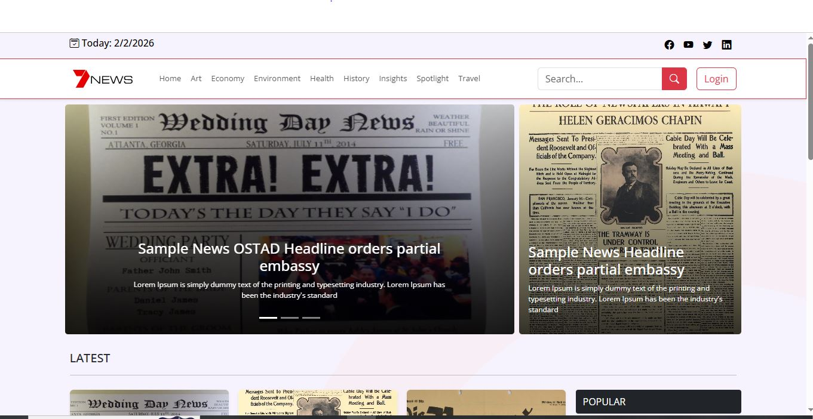

# News Website

This project is a fully responsive news website developed to deliver a smooth and engaging news reading experience.
It is built using **Next.js, HTML, CSS, Bootstrap, Prisma ORM, and MySQL**, providing efficient performance, secure authentication, and dynamic content management.

The platform allows users to browse news articles, search posts, manage profiles, and interact with content through comments. It also includes a secure authentication system with **JWT tokens and OTP-based password recovery**.

---

## Project Preview

Below are some screenshots demonstrating the main features and interface of the News Website.



---

## Features

* Fully responsive design for desktop, tablet, and mobile devices
* News browsing and article reading functionality
* Search functionality for finding news posts
* User authentication system:

  * User registration and login
  * JWT token-based authentication
  * Password recovery using OTP verification
* User profile management and profile update
* Commenting system for news articles
* Secure backend API for handling user and content operations
* Optimized rendering using modern Next.js features:

  * Server-Side Rendering (SSR)
  * Static Site Generation (SSG)

---

## Tech Stack

**Frontend**

* HTML
* CSS
* Bootstrap
* Next.js

**Backend**

* Next.js API Routes

**Database**

* MySQL

**ORM**

* Prisma ORM

**Authentication**

* JWT Token Authentication
* Custom login, registration, and OTP-based password recovery

---

## Project Structure

```id="pv4h9s"
project-root
│
├── pages
│   ├── index.js
│   ├── news
│   ├── profile
│   └── api
│       ├── auth
│       ├── comments
│       └── posts
│
├── components
│
├── prisma
│   └── schema.prisma
│
├── styles
│
└── README.md
```
